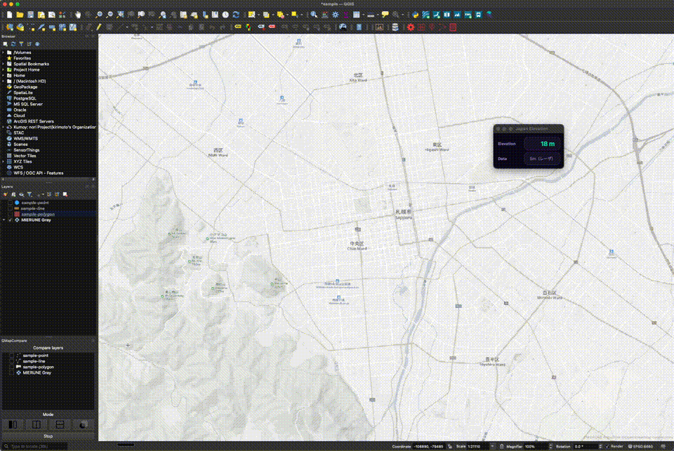

# Japan Elevation Plugin

他の言語で読む: [英語](./README.md)


国土地理院の[標高API](https://maps.gsi.go.jp/development/elevation_s.html)を利用し指定した位置の標高値をQGIS上に表示

## QGIS Python Plugins Repository

[Japan Elevation Pluginn](https://plugins.qgis.org/plugins/japan_elevation)    

## blog


## 利用方法



1. Japan Elevationボタンをクリック
2. マップキャンバス上の任意の場所をクリックします。
3. 標高値とデータソースがダイアログに表示されます。

## 開発

### 必要なツール

- [uv](https://docs.astral.sh/uv/)
- QGIS 3.x

### セットアップ

```bash
# 依存関係のインストール
uv sync

# リント
uv run ruff check .

# フォーマット
uv run ruff format .
```

### ローカル開発

QGISのプラグインディレクトリにシンボリックリンクを作成します：

**macOS:**
```bash
ln -s /path/to/japan_elevation ~/Library/Application\ Support/QGIS/QGIS3/profiles/default/python/plugins/japan_elevation
```

**Windows:**
```powershell
mklink /D "%APPDATA%\QGIS\QGIS3\profiles\default\python\plugins\japan_elevation" "C:\path\to\japan_elevation"
```

**Linux:**
```bash
ln -s /path/to/japan_elevation ~/.local/share/QGIS/QGIS3/profiles/default/python/plugins/japan_elevation
```

コードを編集した後、QGISでプラグインをリロードすると変更が反映されます。

## ライセンス

Python modules are released under the GNU General Public License v2.0

Copyright (c) 2018-2026 Yasunori Kirimoto
